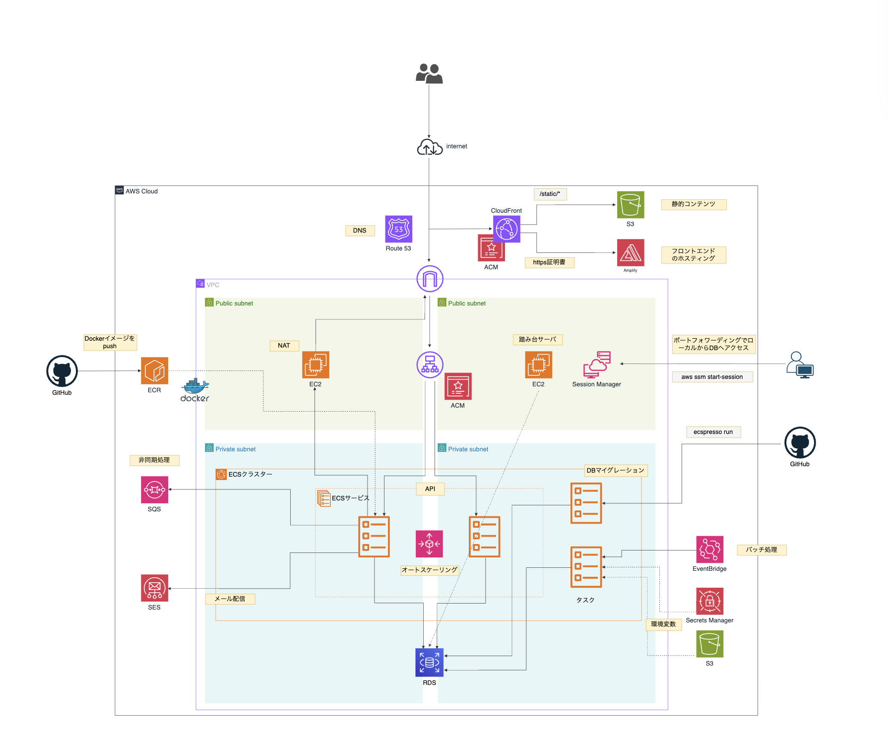
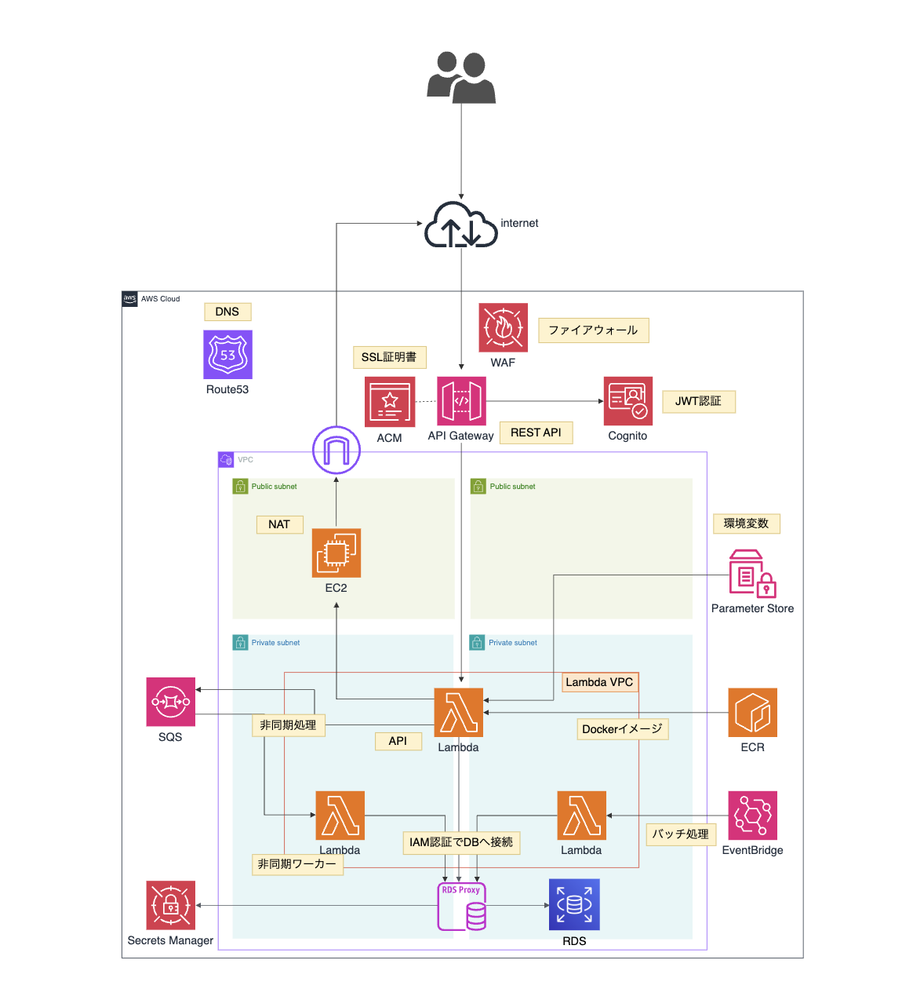

# AWS 個人学習リポジトリ

実際に手を動かして構築した学習用リポジトリです。

現在の主流であるコンテナ技術（ECS）に加え、サーバーレスアーキテクチャ（Lambda）も実務で問われる機会が多いため、双方の設計思想・運用方法の違いを理解する目的で2パターンの構成を構築しました。共通のVPC・RDS等の基盤リソース上に、それぞれのアーキテクチャを実装しています。

構築後は、Terraform（一部 `terraform import` を使用）によりコード化し、IaCでの管理を実践しました。

---

## リポジトリ構成

```
.
├── docs                 # 構成図
├── modules
│   └── aws              # 共通Terraformモジュール群
├── prd                  # 本番環境
│   ├── aws.tf
│   ├── backend.tf
│   ├── outputs.tf
│   ├── variables.tf
│   └── versions.tf
└── stg                  # ステージング環境
    ├── aws.tf
    ├── backend.tf
    ├── variables.tf
    └── versions.tf
```
`modules/aws` に環境共通のリソース定義を集約し、`prd`/`stg` 各ディレクトリではその module を呼び出しつつ、環境差分のある値のみ `variables.tf` で切り替える構成としています。

---

## 構成①：コンテナ3層構成（ALB / ECS / RDS）※メイン

Webアプリケーションの一般的なコンテナ3層構成。ECS（Fargate）上でAPI・バッチ・DBマイグレーションの3種類のタスクを、環境変数によって役割を切り替えて運用する設計。

### 構成図


### こだわりポイント
- **セキュリティグループ設計：** サービスごとにSGを分割することで、SG名・IDから通信関係が一目で把握できる設計とした
- **NATインスタンス：** コスト最適化のためNAT GatewayではなくEC2によるNATインスタンスを採用。可用性はNAT Gatewayに劣るが検証環境として許容し、使わない時間帯は停止することで柔軟にコストを調整できる構成とした
- **踏み台サーバー：** SSHではなくSession Manager経由のポートフォワーディングでDBへアクセスする構成とし、SSH鍵管理・22番ポート開放を不要にしたセキュアな運用を実現
- **ECS構成：** サービスはプライベートサブネットに配置しパブリックIPを無効化。CPU使用率ベースの追跡スケーリングを設定し、負荷試験でスケールアウトを確認
- **機密情報管理：** DBパスワード等の機密情報はSecrets Manager、アプリが参照する非機密の環境変数はS3で管理し使い分け
- **RDS：** サブネットグループで複数AZのプライベートサブネットを束ね、Multi-AZ構成として配置
- **保守対応：** RDSの脆弱性対応バージョンアップなど、構築後の運用・保守も実施
- **CI/CD：** ecspressoによるECSタスク定義・サービスのデプロイ管理、GitHub Actionsを用いたビルド〜デプロイの自動化を実施（Dockerイメージのビルド→ECRへのpush→ecspressoでのデプロイ。CI/CD設定はアプリケーション側の別リポジトリで管理しているため、本リポジトリには含まれません）

### 主な使用技術
- **配信・DNS：** Route53, CloudFront, ACM, S3（静的コンテンツ）, Amplify（フロントエンドホスティング）
- **コンピューティング：** ECS（Fargate）, EC2（NAT／踏み台）
- **DB：** RDS
- **非同期・通知：** SQS, SES
- **バッチ：** EventBridge
- **CI/CD：** GitHub Actions, ECR, ecspresso
- **アクセス管理：** Session Manager
- **シークレット管理：** Secrets Manager

---

## 構成②：サーバーレス構成（API Gateway / Lambda / RDS Proxy）※比較学習

API Gateway経由でLambdaを呼び出すサーバーレス構成。ECS構成と同様、API・非同期ワーカー・バッチ処理の役割を、環境変数によってLambdaに与える設計。DB接続はIAM認証によりRDS Proxy経由で行う。

比較学習として、Cognitoによる認証基盤、IAM認証でのDB接続なども取り入れて一通り動作する状態まで組み上げました。ECS構成と比べるとまだ設計の意図を語れる深さには至っていない部分もあり、引き続き理解を深めている段階です。

### 構成図


### 主な使用技術
- **API・認証：** API Gateway（REST API）, WAF, Cognito（JWT認証）, ACM
- **コンピューティング：** Lambda（API／非同期ワーカー／バッチ）
- **DB：** RDS Proxy（IAM認証）+ RDS
- **非同期・バッチ：** SQS, EventBridge
- **シークレット・設定管理：** Secrets Manager, Parameter Store
- **コンテナイメージ：** ECR（Lambdaコンテナイメージ）

---

## 補足

- 現在はサーバーレス構成（②）を稼働させており、コンテナ構成（①）側はコスト都合により一部リソースをコメントアウトした状態で停止中です

---

## Terraform設計

- **Module設計：** stg/prd環境間で差分のある値（インスタンスサイズ、ドメイン名等）は変数化し、共通のTerraform moduleをstg/prd両環境で使い回せる設計とした

